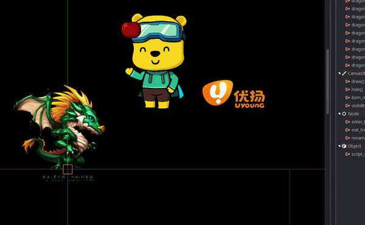

# GDDragonBones Plugin
Plugin module for Godot 2.1.4 Game Engine to use DragonBones

## Links
* Homepage Godot: https://godotengine.org
* Homepage DragonBones: http://dragonbones.com

#### Support Versions
* Godot 2.1.4
* DragonBones Pro 5.6

#### Compiling
1. Drop the "GDDragonBones" directory inside the "modules" directory on the Godot source.

2. [See the official docs](http://docs.godotengine.org/en/latest/development/compiling/)
for compilation instructions for every supported platform.

* Compiling Godot Engine with flag for Android: 

```python
android_stl=yes
```

* For iOS not Tested at this moment, maybe some compilation trouble.

* [Godot Engine Src](https://github.com/godotengine/godot)
* [DragonBones common library](https://github.com/DragonBones/DragonBonesCPP)

##
[]()

## Samples

#### Play/Stop animation
```python
var skeleton = get_node("skeleton")

# if needed set speed animation
skeleton.set_speed(0.5)

# set current animation, if not choosed before
skeleton.set("playback/curr_animation", "walk")

# start play	
skeleton.play()

# start play from time in sec
skeleton.play_from_time(2);

# start play from progress [0 - 1]
skeleton.play_from_progress(0.5);

#stop animation
skeleton.stop()

#stop all animation
skeleton.stop_all()
```

#### Mixing(blending) animation
```python
var skeleton = get_node("skeleton")

# if needed set speed animation
skeleton.set_speed(0.5)

# play animation by layers, see DragonBones documentation for parametrs
skeleton.fade_in("idle", -1, -1, 2, "", GDDragonBones.FadeOut_All)
# 1. "idle" 	-- The name animation.
# 2. "-1" 	-- The fade in time. [-1: Use the default value of animation data, [0~N]: The fade in time (In seconds)] (Default: -1)
# 3. "-1" 	-- playing repeat times. [-1: Use the default value of animation data, 0: No end loop playing, [1~N]: Repeat N times] (Default: -1)
# 4. "2" 	-- The blending layer, the animation states in high level layer will get the blending weights with high priority, when the total blending weights are more than 1.0, there will be no more weights can be allocated to the other animation states. (Default: 0)
# 5. "" 	-- The blending group name, it is typically used to specify the substitution of multiple animation states blending. (Default: null)
# 6. GDDragonBones.FadeOut_All -- The fade out mode, which is typically used to specify alternate mode of multiple animation states blending. (Default: GDDragonBones.FadeOut_SameLayerAndGroup)
#	GDDragonBones.FadeOut_None 		-- Do not fade out of any animation states.
#	GDDragonBones.FadeOut_SameLayer 	-- Fade out the animation states of the same layer.
#	GDDragonBones.FadeOut_SameGroup 	-- Fade out the animation states of the same group.
#	GDDragonBones.FadeOut_SameLayerAndGroup -- Fade out the animation states of the same layer and group.
#	GDDragonBones.FadeOut_All 		-- Fade out of all animation states.	
#	GDDragonBones.FadeOut_Single  		-- Does not replace the animation state with the same name.
#
# skeleton.fade_in("walk", 0.3, 0, 0, "normalGroup", GDDragonBones.FadeOut_All)

# run animation in "1" layer
skeleton.fade_in("eyes_idle", -1, -1, 1, "", GDDragonBones.FadeOut_SameLayer)

# stop specified animation by name
skeleton.fade_out("eyes_idle")

```

#### Set pose from animation
```python
var skeleton = get_node("skeleton")

# choose animation
skeleton.set("playback/curr_animation", "idle")

# seek animation [0.0-1.0]
skeleton.seek(0.5)

```
